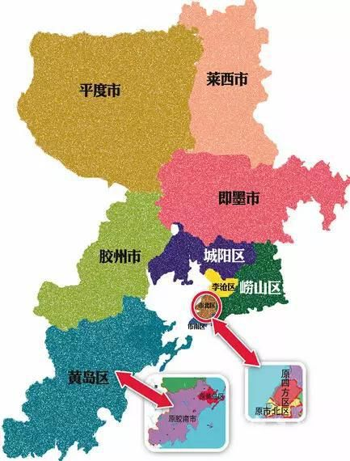
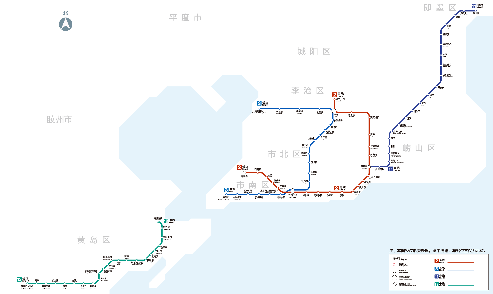
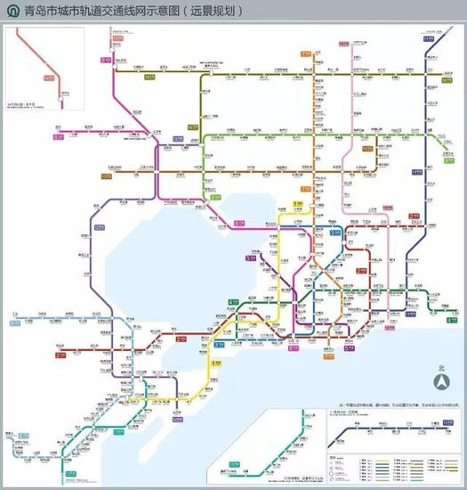
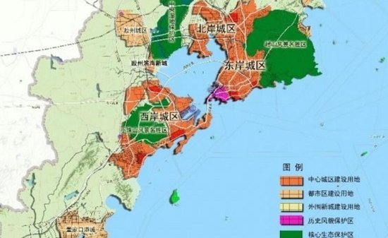

	   青岛房产知识扫盲
	   -- 图片来自网络，侵权删
	   -- 数据不保证完全准确，错误之处还望海涵，如需深入使用还望自己求证。
	   -- 买房有风险，投资需谨慎 ，资料内容不保证完全正确，使用需谨慎。
* [一、青岛资源分布](#id-资源分布-)    
    1. [青岛板块](#id-板块-)  
    1. [地铁规划](#id-地铁规划-)
	1. [三城联动发函](#id-三城-)
## <a name="id-资源分布-"> 一、青岛资源分布</a>
### <a name="id-板块-"> 1、 青岛板块</a>

### <a name="id-地铁规划-"> 2、 地铁规划</a>
现有地铁

将会规划建设的地铁

### <a name="id-三城-">3、 三城联动</a>
根据去年国务院正式批复的《青岛市城市总体规划（2011——2020）》，青岛分成城市主中心、城市副中心、东岸城区、北岸城区、西岸城区，将青岛打造成“三城联动、组团发展”的海湾型中心城区。  

每年至少开通一条地铁，在政府工作报告中，未来5年，青岛的地铁将初步成交通网。不仅如此，地铁成网后，市民乘坐地铁1小时可畅达大青岛的三湾三城。作为城市新的交通工具，地铁让城市每个角落都连接流动起来，城市不同区域之间都连接在一起。全城诺比邻，整个城市的发展变得更加协调。

